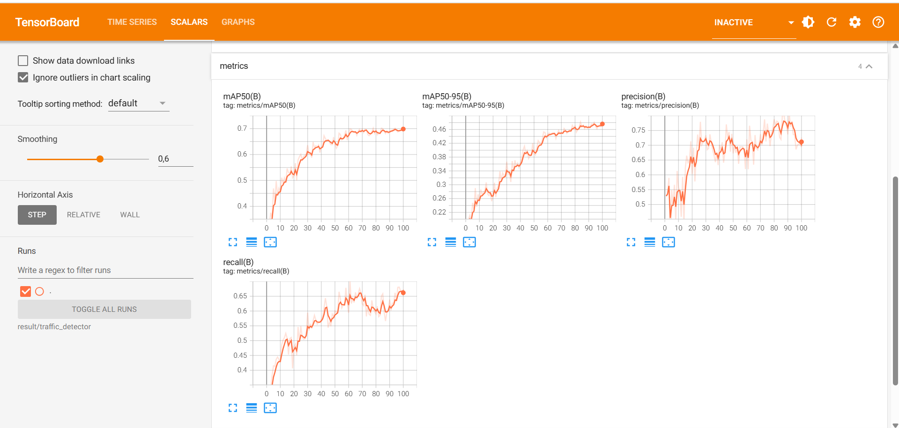

# Detect Vehicle (Using the YOLO object detection model and YOLO's solution.)

Ứng dụng học sâu (Deep learning) vào bài toán phạt hiện đối tượng đi là xe cộ trong thời gian thực tế 
tại các camera và sử dụng các giải pháp có sẵn của yolo 

---

## 1. chức năng 
- dữ đoạn ảnh hoặc video có những đối tượng xe cộ nào
- sử dụng các giải pháp :
  - đếm số lượng xe trong một vùng
  - đếm số lượng xe trong nhiều vung khác nhau trên đường
  - biểu đồ nhiệt cho thấy vị trí đậm mầu thường xuyên suất hiện đối tượng
  - object tracking
  - đo tốc độ của các phương tiện
- bao gồm 5 class :
  - vehicles
  - bicycle
  - bus
  - car
  - motorbike
  - truck

## 2. kết quả 
### 2.1 trong quá trình train


### 2.2 một số kêt quả của sử dụng giải pháp


---

## 3. Cấu trúc thư mục

```text
helmet_detection/
├── configs
├── data
│   ├── processed
│   │   ├── images
│   │   │   ├── train
│   │   │   └── valid
│   │   └── labels
│   │       ├── train
│   │       └── valid
│   ├── raw
│   │   ├── test
│   │   ├── train
│   │   └── valid
│   └── test
├── result
│   ├── predict
│   ├── solution
│   └── traffic_detector
│       └── weights
├── src
└── weights
```

---

## 4 Dataset

### 4.1 Tải dữ liệu

- link tải dữ liệu:  
 https://universe.roboflow.com/traffic-camera/vehicles-22g3b/dataset/11


### 4.2 Cách dùng dữ liệu
1.Đặt vào thư mục:
```text
data/raw
      ├── test
      ├── train
      └── valid
```
2. chia dữ liệu thành đùng dữ liệu đang cần
```bash
python -m src.prepare_data
```

--- 

## 5. Cài đặt

### 5.1 Tạo môi trường ảo (khuyên dùng)

```bash
python -m venv venv
```

**Windows**
```bash
venv\Scripts\activate
```

**Linux / macOS**
```bash
source venv/bin/activate
```

### 5.2 Cài thư viện

```bash
pip install -r requirements.txt
```

---

## 6. chỉnh cấu hình tham số mặc định
### 6.1 cấu hình đường dẫn
```text
src/config.py
```

### 6.2 cấu hình các tham số model
```text
configs/train_hyp.yaml
```

---
### 7.1 chạy các lệnh sau

```bash
python -m src.train 
```

### 7.2 kết qủa checkpoint sau khi train lưu trong:
```text
result/
```

## 8. chạy docker file

```bash
docker build -t vehicle .

docker run -it --rm --gpus all -v ${PWD}/data/:/work/data  -v ${PWD}/result:/work/result  vehicle  bash
```
sau khi vào trong docker containner chạy lệnh để train model trong docker:
```bash
python -m src.train 
```

## 9. xem quá trình train và triển khai test thử

1. xem quá trình train
```bash
tensorboard --logdir result/traffic_detector 
```
2. test thử
```text
python -m src.inference -i (đường dẫn ảnh)
python -m src.inference -v (đường dẫn video)
```
3. các giải pháp của yolo cung cấp
- đếm số lượng xe trong một vùng:
```bash
python -m src.object_counting_yolo
```

- đếm số lượng xe trong nhiều vung khác nhau trên đường:
```bash
python -m object_counting_region_yolo
```

- biểu đồ nhiệt cho thấy vị trí đậm mầu thường xuyên suất hiện đối tượng:
```bash
python -m Heatmaps_yolo
```

- đo tốc độ của các phương tiện:
```bash
python -m speed_estimation_yolo
```


- kết quả sẽ đc lưu trong folder results